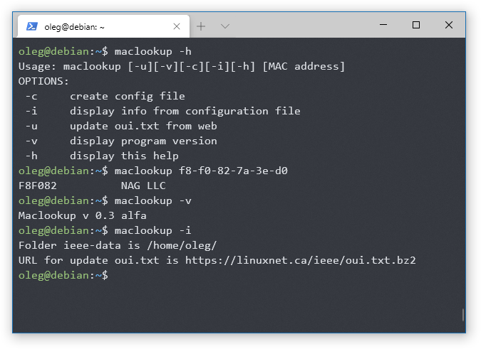

# Maclookup
Программа для поиска вендора по аппаратному (MAC) адресу

Для поиска используется файл _oui.txt_ из состава пакета _ieee-data_, либо скачанного с сайта https://linuxnet.ca/

Принимает в качестве аргумента MAC адрес в формате XX:XX:XX:XX:XX:XX либо XX-XX-XX-XX-XX-XX

В конфигурационном файле ~/.maclookup содержится две строки:

 * **folder** - для указания директории расположения oui.txt
 * **url** - ссылка для обновления файла oui.txt
## Установка
### From Source

1. Download the latest release from https://github.com/shulepoff/maclookup/releases
1. Extract files from archive. `tar xzvf v0.3-alpha.tar.gz`
1. `cd maclookup`
1. `sudo make install`

По умолчанию программа устанавливается в `/usr/local/bin`. Если Вы желаете изменить место установки, запустите `sudo DESTDIR=/path/to/install/ make install`

## Удаление программы
Перейдите в каталог с исходниками и выполните `sudo make uninstall`
или
удалите вручную файлы `/usr/local/bin/maclookup` и `/usr/share/man/man1/maclookup.1.gz`
